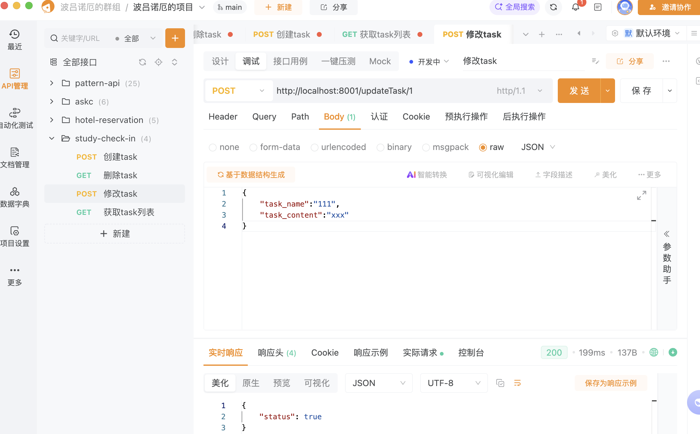
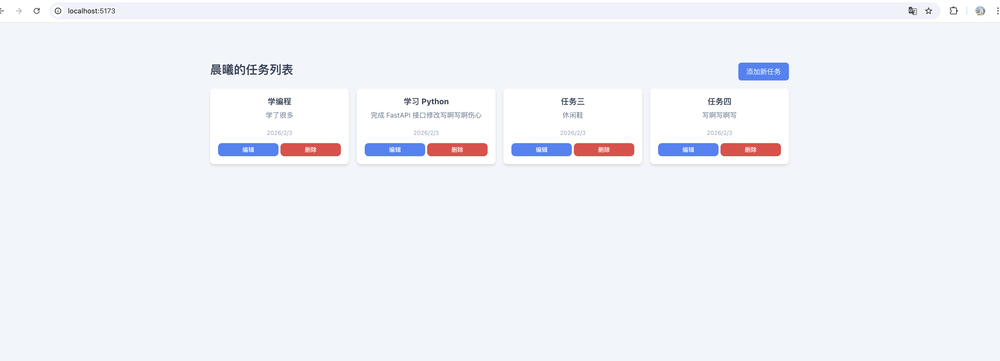

# 问题指摘，以及这周考试内容，周六/周日

# 下载工具以及问题指摘
下载apipost 专业的http接口调试工具https://www.apipost.cn/
 

### 问题一
 创建task接口，一般关系型数据库，id都是自动增长的，不需要用户传入
 ，时间也不需要传入，后端可以自动获取系统时间
 

### 问题二
修改 ，一般会根据主键 也就是id去数据库查找，并做修改，，id一般通过url/{id}
传入，，其他数据可以通过body传入

### 问题三
 删除，一般也要符合restful风格api，，url/{id}，通过id传入

 
## 考试内容
目前task前端和后端的增删改查基本代码都写好了，先看懂代码，在深入理解原理
可以把前端，后端都运行起来，在网页看效果
下面的内容可以把答案，写在这个md里，，考试时候是闭卷

### 考试内容一，重点，一行一行的看
必须：读懂目前task，增删改查的所有后端代码
选择：前端可以选择去看，只需要知道如何加载你写的后端数据即可

### 考试内容二
学习什么叫做 restful api，并说明
@router.post("/updateTask/{task_id}", response_model=dict)
接口为什么这样设计

### 考试内容三
学习http协议，tcp协议，，要懂最基本的概念，知道是干嘛的？
post请求的body是什么？
get请求的 url参数是什么？
http-header又是什么？

### 考试内容四

为什么在网页输入 http://localhost:5173/
页面就加载出来了，，并能正确的加载你写的接口数据？

说出网页输入http://localhost:5173/ 会发生什么？已经如何调用的你的代码，浏览器会做什么事情，全部搞清楚

### 考试内容五
数据库的主键是什么？postgre自动增长如何配置？
数据表的1对多关系，和多对一关系是什么？
数据库的左连接，右连接，内连接有什么区别？

ps：以上都会了，，基本的http后端+数据库的概念就有了，，加油，我最聪明的大徒弟，基本的概念有了，就要独立写一个模块了
